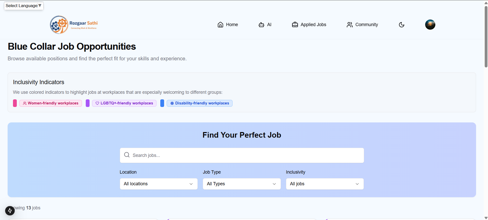
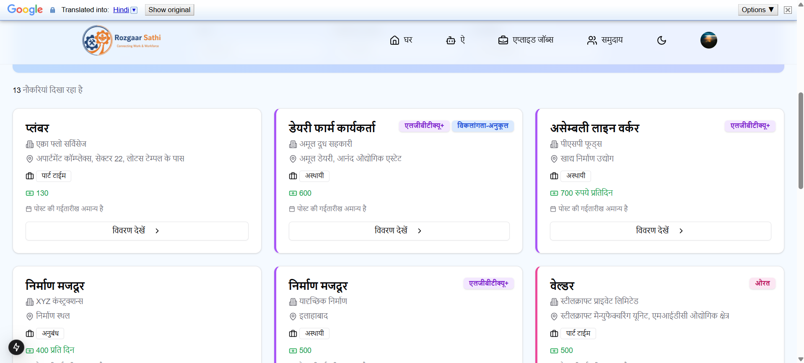
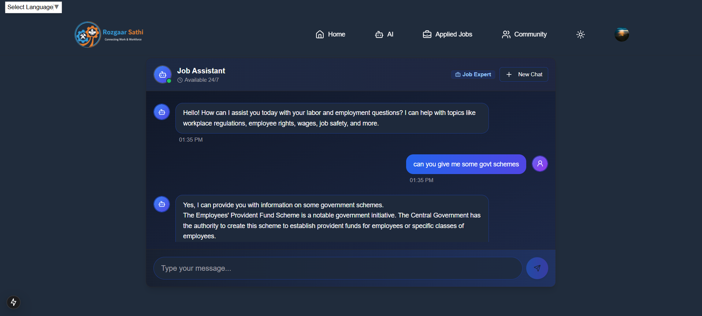
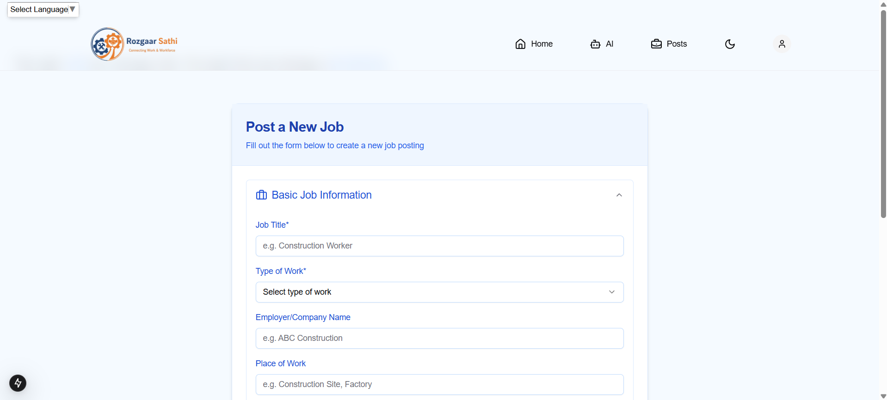
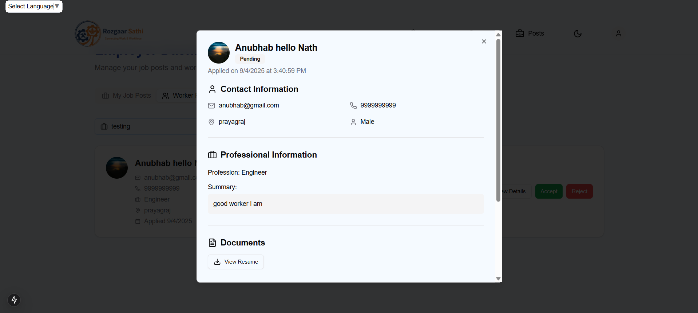
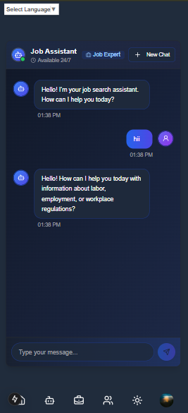
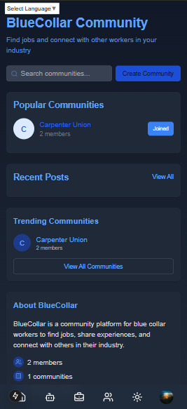
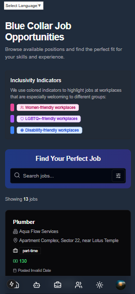

# Rozgaar Sathi

Rozgaar Sathi is a platform designed to empower rural blue-collar workers by connecting them with job opportunities and providing a supportive community. Our platform includes job listings, worker profiles, a community dashboard, an AI-powered chatbot for job assistance, and Google Maps integration to help workers find jobs nearby.

---

## 🌟 Features

* **Job Listings** – Easily browse and apply for blue-collar job opportunities.
* **Community Dashboard** – Engage with a supportive network of workers and employers.
* **Worker Profiles** – Showcase skills, experience, and certifications for better hiring opportunities.
* **AI-Powered RAG Chatbot** – Get real-time answers on labor laws, wages, and job schemes.
* **Map Integration** – View job locations and find opportunities near you.
* **Multilingual Support** – Integrated with Google Translate API for seamless regional language accessibility.
* **User Authentication & Profile Management** – Secure access and personalized experience.
* **Responsive Design** – Optimized for both mobile and desktop devices.

---

## 🧠 Tech Stack

* **Frontend**: Next.js, React, Tailwind CSS, Google Maps API, Firebase
* **Backend**: Hono.js, Firebase, Cloudinary
* **AI Module**: FastAPI, LangChain, Gemini 2.5 Flash
* **Additional Integrations**: Google Translate API
* **Development Environment**: VS Code
* **Requirements**: Google Cloud Credentials

---

## ⚙️ Installation

### Prerequisites

Ensure you have the following installed:

* Node.js & npm
* Python & pip
* Google Cloud SDK (for credential management)

---

### Clone the Repository

```sh
git clone https://github.com/anubhabnath098/dti_project.git
cd dti_project
```

---

### Install Dependencies

#### Frontend & Server

```sh
cd frontend  # Navigate to frontend directory
npm install
cd server  # Navigate to backend directory
npm install
```

#### AI Module

```sh
cd ai  # Navigate to AI directory
pip install -r requirements.txt
```

---

## 🚀 Running the Project

### Start Frontend & Server

```sh
npm run dev  # Run frontend and server (in respective directories)
```

### Start AI Module

```sh
uvicorn app:app --reload
```

---

## 🔑 Environment Variables

### Frontend `.env` File

```env
NEXT_PUBLIC_FIREBASE_API_KEY=
NEXT_PUBLIC_FIREBASE_AUTH_DOMAIN=
NEXT_PUBLIC_FIREBASE_PROJECT_ID=
NEXT_PUBLIC_FIREBASE_STORAGE_BUCKET=
NEXT_PUBLIC_FIREBASE_MESSAGING_SENDER_ID=
NEXT_PUBLIC_FIREBASE_APP_ID=
NEXT_PUBLIC_FIREBASE_MEASUREMENT_ID=
NEXT_PUBLIC_BACKEND_URL=
NEXT_PUBLIC_GOOGLE_MAPS_API_KEY=
NEXT_PUBLIC_CHAT_URL=
NEXT_PUBLIC_GOOGLE_TRANSLATE_API_KEY=
```

### Server `.env` File

```env
PORT=
FIREBASE_API_KEY=
FIREBASE_APP_AUTH_DOMAIN=
FIREBASE_PROJECT_ID=
FIREBASE_STORAGE_BUCKET=
FIREBASE_MESSAGING_SENDER_ID=
FIREBASE_APP_ID=
FIREBASE_MEASUREMENT_ID=
FIREBASE_SERVICE_ACCOUNT=
TEST_USER_EMAIL=
TEST_USER_PASSWORD=
```

### FastAPI `.env` File

```env
EMBEDDINGS_MODEL_ID=
GOOGLE_CLOUD_PROJECT=
GOOGLE_MODEL_ID=
GOOGLE_API_KEY=
```

---

## 📸 Screenshots

| Feature                              | Screenshot                                                   |
| ------------------------------------ | ------------------------------------------------------------ |
| 🏠 Homepage                          |                  |
| 🌐 Multilingual Support              |  |
| 🤖 AI RAG Chatbot                    |                 |
| 👔 Employer’s Portal                 |    |
| 👷 Worker’s Profile                  |      |
| 💼 Jobs Listing                      |          |
| 📱 Mobile Responsiveness – Chatbot   |      |
| 📱 Mobile Responsiveness – Community |  |
| 📱 Mobile Responsiveness – Homepage  |    |

---

## 🤝 Contributing

1. Fork the repository
2. Create a new branch (`git checkout -b feature-branch`)
3. Commit your changes (`git commit -m 'Add feature'`)
4. Push to the branch (`git push origin feature-branch`)
5. Open a Pull Request

---

## 📄 License

This project is licensed under the **MIT License**.
